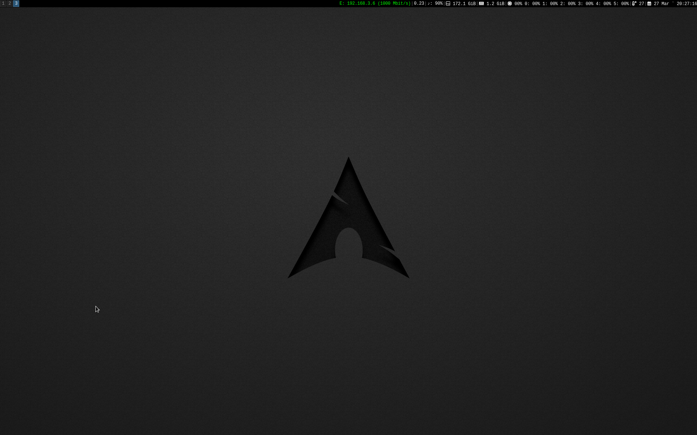

# i3-config

## My screen 
Everything is very simple! Very simple configuration. Nothing extra.

## Dependencies

- **xss-lock** - use external locker as X screen saver
- **dex** - DesktopEntry Execution
- **pactl** - Control a running PulseAudio sound server
- **i3-sensible-terminal** - launches $TERMINAL with fallbacks (I use tilda like terminal)
- **dmenu** - dynamic menu
- **i3-nagbar** - displays an error bar on top of your screen
- **i3-config-wizard** - creates a keysym based config based on your layout
- **nm-applet** - network monitor and control GUI applet